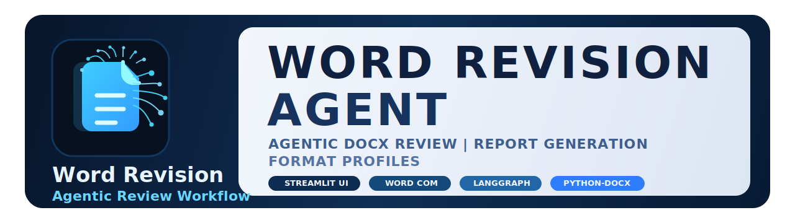
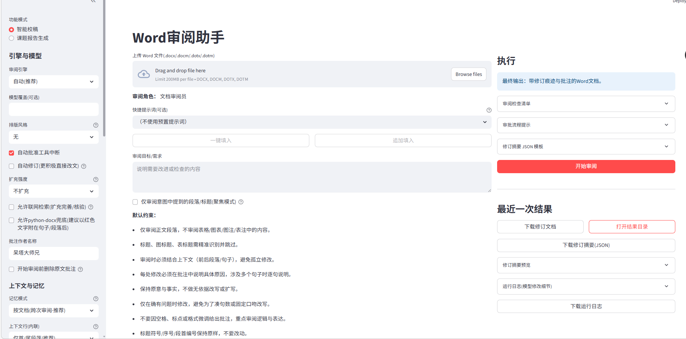
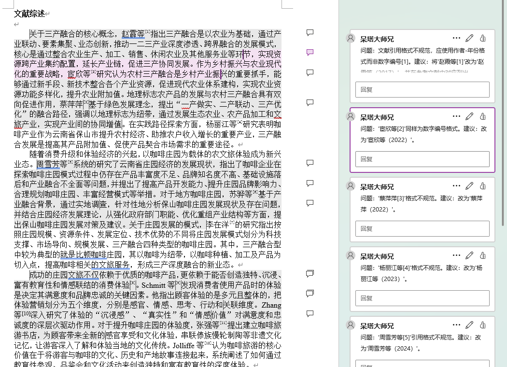
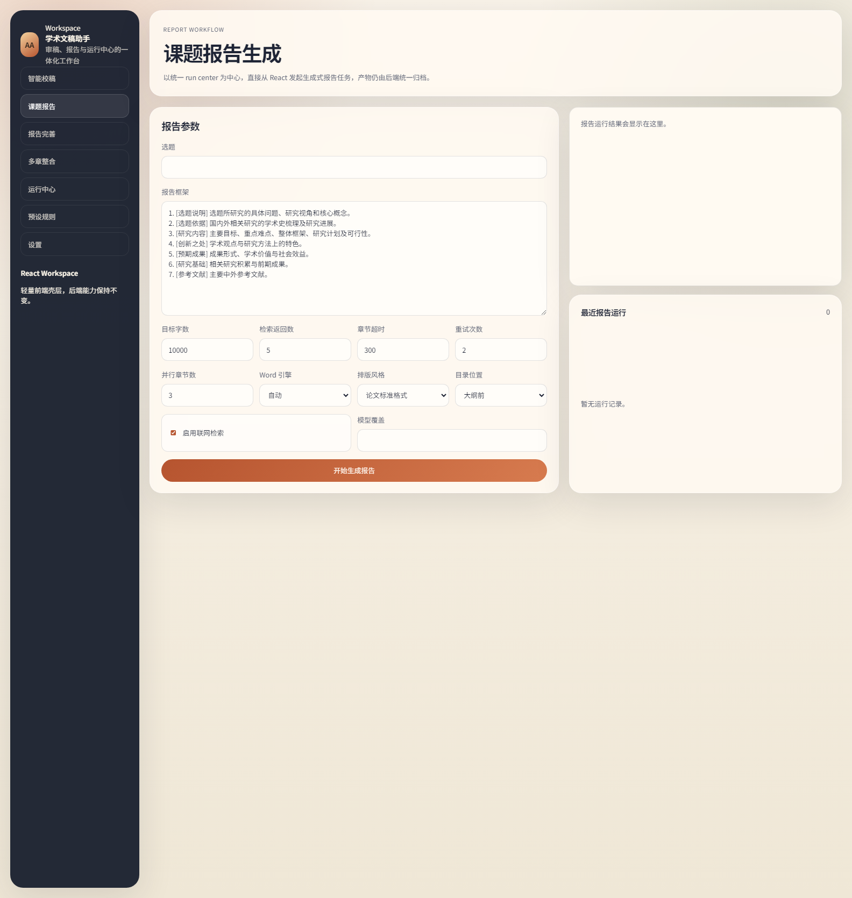
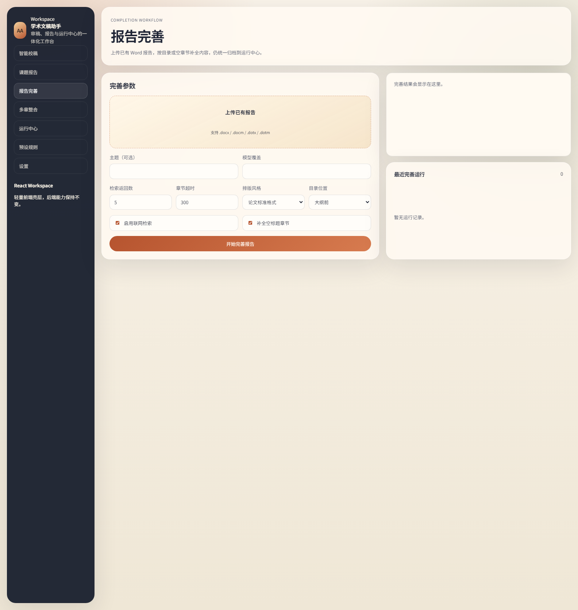
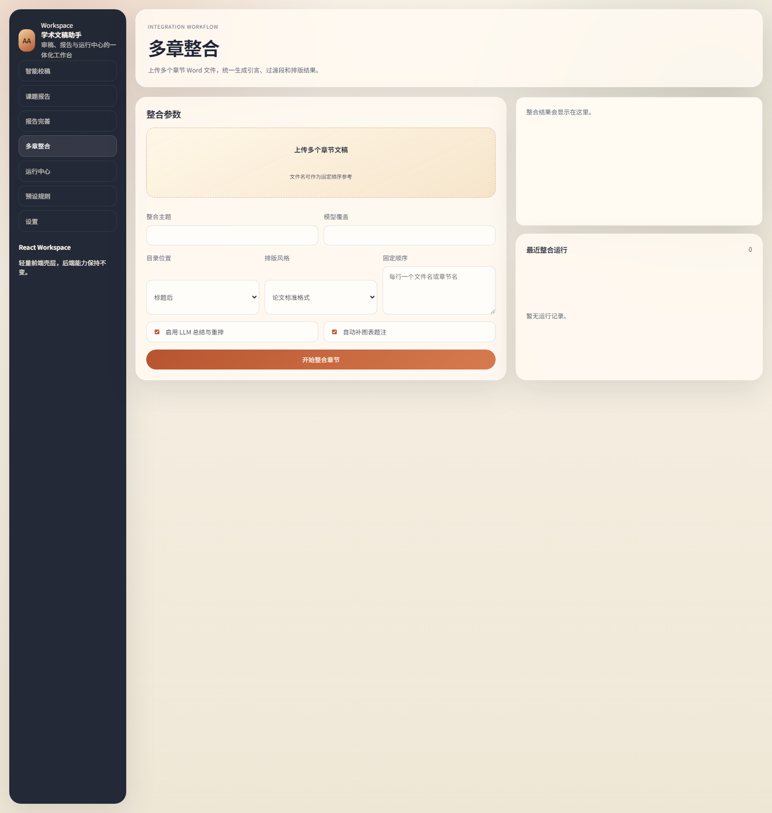
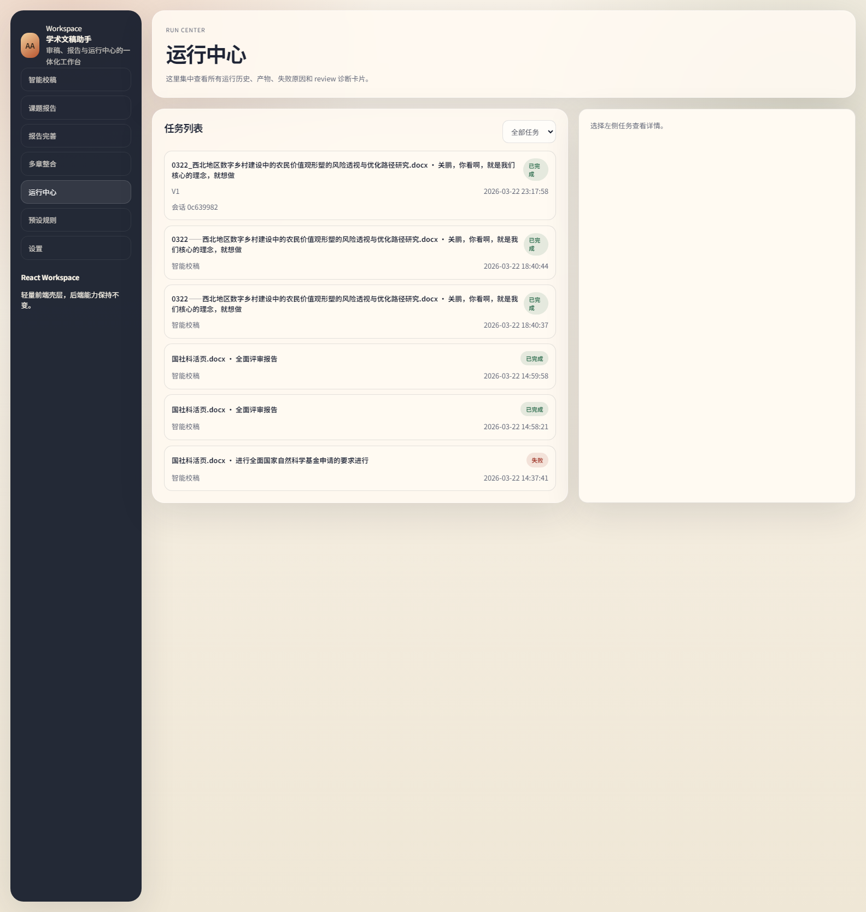
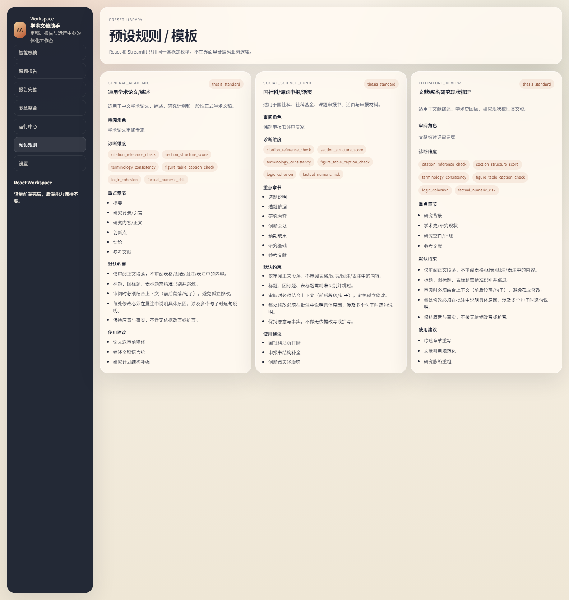
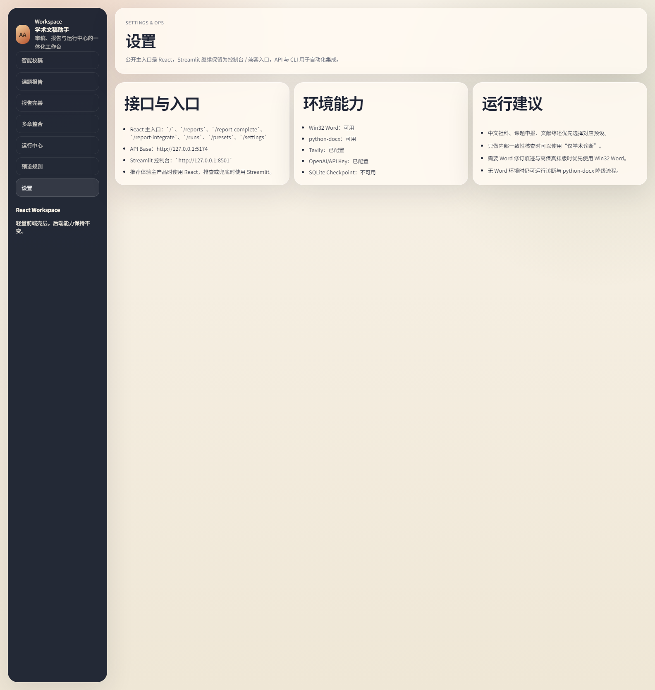

<p align="center">
  
</p>

# 学术文稿助手 / Academic Writing Assistant

面向中文社科论文、课题申报书、文献综述与相关学术写作场景的本地优先开源项目。它将 `智能校稿`、`学术诊断`、`课题报告生成`、`报告完善`、`多章整合` 收敛到同一套服务层、API 和运行中心之下。

Academic Writing Assistant is a local-first open-source project for Chinese academic writing workflows. It unifies smart review, structured diagnostics, report generation, report completion, and chapter integration under one shared service layer and one run center.

- 仓库地址 / Repository: <https://github.com/Akun-python/Aireviewer>
- React 前端主入口 / Primary UI: `http://127.0.0.1:5174`
- API 默认地址 / Default API: `http://127.0.0.1:8011`
- Streamlit 控制台 / Fallback Console: `http://127.0.0.1:8501`

## 目录 / Contents

- [项目概览 / Overview](#项目概览--overview)
- [适用场景 / Use Cases](#适用场景--use-cases)
- [核心能力 / Core Capabilities](#核心能力--core-capabilities)
- [系统入口与架构 / Interfaces & Architecture](#系统入口与架构--interfaces--architecture)
- [界面预览 / Screenshots](#界面预览--screenshots)
- [快速开始 / Quick Start](#快速开始--quick-start)
- [API 概览 / API Overview](#api-概览--api-overview)
- [CLI 用法 / CLI Usage](#cli-用法--cli-usage)
- [产物与目录说明 / Artifacts](#产物与目录说明--artifacts)
- [运行环境 / Environment](#运行环境--environment)
- [参考文档 / Documentation](#参考文档--documentation)
- [引用说明 / Citation & Attribution](#引用说明--citation--attribution)
- [开源与贡献 / License & Contribution](#开源与贡献--license--contribution)
- [目录结构 / Project Structure](#目录结构--project-structure)

## 项目概览 / Overview

这个项目的目标不是做一个泛化到所有办公文档的通用 Word 工具，而是专注于中文学术写作场景中的审阅、诊断、生成和整合流程。

当前版本主要围绕以下目标展开：

- 对中文社科论文、课题申报活页、文献综述进行结构化校稿与学术诊断
- 通过 React 提供更清晰的流程化工作台，同时保留 Streamlit 作为深度控制台
- 通过 FastAPI 暴露统一后端能力，便于前端调用和自动化集成
- 通过统一 `RunStore` 管理运行历史、日志、产物和任务状态

## 适用场景 / Use Cases

- 中文社科论文润色、结构检查、一致性核查
- 课题申报书、活页、论证书的生成与完善
- 文献综述的学术表达优化与引用一致性检查
- 多章节 Word 文档的整合、目录和格式统一
- 需要保留 Word 可交付形态的学术写作工作流

不适合的场景：

- 通用合同、制度、企业办公文书处理
- 与学术写作无关的泛文档编辑器需求
- 不需要 Word 文档产物与运行诊断的纯文本工作流

## 核心能力 / Core Capabilities

### 1. 智能校稿 / Smart Review

- 支持共享学术预设：`general_academic`、`social_science_fund`、`literature_review`
- 支持围绕意图、专家视角、约束条件进行审阅
- 支持诊断输出、上下文控制、联网搜索、扩写与图表提取等增强选项
- 结果统一纳入运行中心，方便回看版本与产物

### 2. 学术诊断 / Academic Diagnostics

诊断结果统一收敛为单个 `*.diagnostics.json`，当前重点覆盖：

- 引用与参考文献核查
- 章节结构评分
- 术语与缩略语一致性
- 图表与题注核查
- 逻辑与衔接诊断
- 事实与数字变更风险

### 3. 课题报告生成 / Report Generation

- 从选题与框架出发生成完整报告
- 支持联网检索、章节并行、目录位置控制与格式模板
- 产物由后端统一归档，前端只负责工作流与展示

### 4. 报告完善 / Report Completion

- 上传已有 Word 报告
- 对空标题、缺失章节或已有框架进行补全
- 继续接入统一运行中心，便于查看进度与结果

### 5. 多章整合 / Chapter Integration

- 上传多个章节型 Word 文件
- 统一目录、排序、标题与章节衔接
- 可选自动图表题注和 LLM 整合增强

## 系统入口与架构 / Interfaces & Architecture

### 当前入口 / Interfaces

| 入口 / Interface | 定位 / Role | 当前能力 / Current Capability |
| --- | --- | --- |
| React | 主产品入口 / Primary product UI | 智能校稿、课题报告、报告完善、多章整合、运行中心、预设规则、设置 |
| Streamlit | 控制台 / Fallback console | 参数最全、日志观察、人工排查、报告类流程兜底 |
| FastAPI | 服务层 / Service layer | Review / diagnostics / presets / report / run-center APIs |
| CLI | 自动化入口 / Automation | 文稿审阅、预设选择、诊断输出、诊断-only 模式 |

### 推荐使用路径 / Recommended Path

- 想直接体验主产品界面：使用 React
- 想深度调参数或排查问题：使用 Streamlit
- 想做系统集成或自动化：使用 FastAPI 或 CLI

### 架构关系 / Architecture

```text
React / Streamlit / CLI
          ↓
       FastAPI
          ↓
Shared Services
  - review service
  - diagnostics service
  - report service
  - preset service
  - capability service
          ↓
RunStore / ConversationStore / workspace artifacts
```

### React 路由 / React Routes

- `/`
- `/reports`
- `/report-complete`
- `/report-integrate`
- `/runs`
- `/presets`
- `/settings`

## 界面预览 / Screenshots

### 智能校稿界面 / Smart Review Workspace



中文：React 作为主入口提供流程化工作台；Streamlit 继续保留完整控制台入口，便于调试、排查和参数细调。

English: React is the primary workflow UI, while Streamlit remains available as the full control console for debugging and deep parameter tuning.

### 修订结果 / Revision Result



中文：修订结果保留 Word 可交付文档形态，同时输出修订摘要、运行日志与学术诊断 JSON，方便人工复核。

English: The result keeps a deliverable Word document and also emits revision summary, run logs, and diagnostics JSON for manual verification.

### 课题报告生成 / Report Workflow



中文：展示从选题、框架、联网检索和格式控制出发的报告生成工作流。

English: Topic report generation page with framework editing, generation parameters, and a side-by-side result area.

### 报告完善 / Report Completion



中文：针对已有 Word 报告做补全与完善，适合空标题或半成品稿件继续加工。

English: Existing report completion workflow with document upload, completion switches, and run feedback panels.

### 多章整合 / Chapter Integration



中文：将多个章节型 Word 文档整合为一份结构统一的完整报告。

English: Multi-chapter integration page for combining Word sections into one structured report package.

### 运行中心 / Run Center



中文：集中查看所有任务、状态、产物与事件日志，是 React 前端的统一任务面板。

English: Centralized run list for review and report workflows, including recent tasks and status tracking.

### 预设规则 / Preset Library



中文：展示共享学术预设，包括专家视角、诊断维度、默认约束与建议用法。

English: Shared preset cards exposed to both React and Streamlit, showing roles, diagnostics dimensions, and default constraints.

### 设置 / Settings & Ops



中文：汇总 API 地址、接口入口和本地环境能力，方便启动前排查。

English: Environment capability overview covering interfaces, API endpoint, and local runtime readiness.

## 快速开始 / Quick Start

### 环境要求 / Prerequisites

- Python `3.8+`
- Node.js `18+` 与 `npm`
- Windows 环境下如需高保真 Word 修订、目录和排版，建议安装 Microsoft Word

说明：

- 有 Win32 Word 时，项目的修订痕迹、目录、章节整合和高保真格式能力更完整
- 没有 Win32 Word 时，`python-docx` 与 `diagnostics` 仍可运行，但部分 Word 原生能力会降级

### 1. 安装 Python 依赖 / Install Python Dependencies

```powershell
pip install -r requirements.txt
```

### 2. 启动 API / Start the API Server

```powershell
python api_server.py
```

默认监听 / Default:

- `http://127.0.0.1:8011`

### 3. 启动 React 前端 / Start the React Frontend

```powershell
cd frontend
npm install
npm run dev
```

默认地址 / Default:

- `http://127.0.0.1:5174`

### 4. 启动 Streamlit 控制台 / Start the Streamlit Console

```powershell
streamlit run streamlit_app.py
```

默认地址 / Default:

- `http://127.0.0.1:8501`

### 5. 可选：预览 React 生产构建 / Optional Preview Build

```powershell
cd frontend
npm run build
npm run preview
```

默认地址 / Default:

- `http://127.0.0.1:4174`

### 6. 运行前端测试 / Run Frontend Tests

```powershell
cd frontend
npm run test
```

## API 概览 / API Overview

### System

- `GET /api/health`
- `GET /api/capabilities`

### Review

- `POST /api/review/runs`
- `POST /api/review/conversations`
- `GET /api/review/conversations`
- `GET /api/review/conversations/{conversation_id}`
- `POST /api/review/conversations/{conversation_id}/messages`
- `GET /api/review/presets`
- `GET /api/review/runs/{id}/diagnostics`

### Reports

- `POST /api/report/runs`
- `POST /api/report-complete/runs`
- `POST /api/report-integrate/runs`

### Run Center

- `GET /api/runs`
- `GET /api/runs/{id}`
- `GET /api/runs/{id}/events`
- `GET /api/runs/{id}/artifacts`
- `GET /api/runs/{id}/artifacts/{artifact_name}`

## CLI 用法 / CLI Usage

### 智能校稿示例 / Smart Review Example

```powershell
python -m app.main `
  --input .\examples\general_academic\乡村治理研究_示例论文.docx `
  --output .\workspace\demo_review.docx `
  --intent "统一术语、检查章节结构并优化学术表达" `
  --preset general_academic `
  --diagnostics
```

### 仅输出学术诊断 / Diagnostics Only Example

```powershell
python -m app.main `
  --input .\examples\social_science_fund\国社科活页_示例.docx `
  --output .\workspace\fund_review.docx `
  --preset social_science_fund `
  --diagnostics-only
```

### 常用参数 / Common Flags

- `--preset`
- `--diagnostics`
- `--diagnostics-only`
- `--model`
- `--revision-engine`
- `--allow-expansion`
- `--allow-web-search`
- `--extract-tables`
- `--extract-images`

## 产物与目录说明 / Artifacts

运行完成后，常见产物包括：

- 修订后的 Word 文档
- 修订摘要
- 运行日志和事件流
- `*.diagnostics.json`
- 表格提取结果 `*.tables.json`
- 图片提取结果 `*.images.json`
- 运行中心中的历史记录与可下载产物

示例数据位于：

- `examples/general_academic`
- `examples/social_science_fund`
- `examples/literature_review`
- `examples/report_integrate`

## 运行环境 / Environment

### 关键依赖 / Key Dependencies

- `deepagents`
- `langchain`
- `langgraph`
- `streamlit`
- `fastapi`
- `uvicorn`
- `python-docx`
- `pywin32`
- `tavily-python`

### 关键环境变量 / Important Environment Variables

- `OPENAI_API_KEY` or `API_KEY`: 模型调用 / model access
- `TAVILY_API_KEY`: 联网检索 / web search
- `API_BASE_URL` or `OPENAI_BASE_URL`: 兼容 OpenAI 的模型网关 / OpenAI-compatible gateway
- `REVIEWER_API_HOST`: API 监听地址
- `REVIEWER_API_PORT`: API 监听端口
- `REVIEWER_FRONTEND_PORT`: React 开发端口

### 能力矩阵 / Capability Matrix

完整能力矩阵见：

- [docs/capability_matrix.md](docs/capability_matrix.md)

简要原则：

- Win32 Word 可用时：高保真修订痕迹、目录、排版、章节整合能力完整
- 无 Win32 Word 时：`python-docx` 与 `diagnostics` 仍可运行，但 Word 原生修订痕迹与部分高保真排版能力会降级

## 参考文档 / Documentation

- [frontend/README.md](frontend/README.md): React 前端说明
- [docs/capability_matrix.md](docs/capability_matrix.md): 功能矩阵与能力边界
- [CONTRIBUTING.md](CONTRIBUTING.md): 贡献指南
- [LICENSE](LICENSE): 开源协议

## 引用说明 / Citation & Attribution

### 1. 学术引用 / Academic Citation

如果你在论文、课题申报书、技术报告或课程作业中引用本项目，建议至少给出仓库名称、仓库地址和访问日期。

中文参考写法示例：

```text
Aireviewer Contributors. Aireviewer：学术文稿助手[EB/OL]. GitHub.
https://github.com/Akun-python/Aireviewer （访问日期请替换为你的实际访问日期）.
```

English citation example:

```text
Aireviewer Contributors. Aireviewer: Academic Writing Assistant [EB/OL].
GitHub. https://github.com/Akun-python/Aireviewer (replace with your actual access date).
```

BibTeX 示例：

```bibtex
@misc{aireviewer,
  author       = {{Aireviewer Contributors}},
  title        = {Aireviewer: Academic Writing Assistant},
  year         = {2026},
  howpublished = {\url{https://github.com/Akun-python/Aireviewer}},
  note         = {GitHub repository, accessed YYYY-MM-DD}
}
```

### 2. README 截图与文档引用 / README Asset Attribution

- `resource/` 目录下用于 README 的界面图均来自本仓库当前前端界面截图
- `resource/title-banner.svg` 为本仓库文档视觉资源
- 如果你转载 README 内容、截图或基于其制作介绍材料，建议保留仓库链接并标明是否做过修改
- 如果你引用 `examples/` 中的示例文件，请说明其用途是演示与测试，而不是正式学术成果

### 3. 二次开发说明 / Reuse Note

- 可以基于本项目继续开发自己的流程或界面
- 若在公开项目、课程作业、论文附录或产品说明中复用本仓库，请优先链接回本仓库主页
- 若你修改了预设、诊断逻辑或前端页面，建议同时标注“基于 Aireviewer 修改”

## 开源与贡献 / License & Contribution

- License: [MIT](LICENSE)
- Contribution Guide: [CONTRIBUTING.md](CONTRIBUTING.md)
- Frontend Guide: [frontend/README.md](frontend/README.md)

## 目录结构 / Project Structure

- `app/`: 运行时代码 / runtime code
- `app/api/`: FastAPI 路由
- `app/services/`: 共享服务层
- `app/workflows/`: review / report 工作流
- `frontend/`: React 前端
- `streamlit_app.py`: Streamlit 控制台
- `examples/`: 示例文档
- `resource/`: README 截图与视觉资源
- `workspace/`: 运行产物与工作目录
